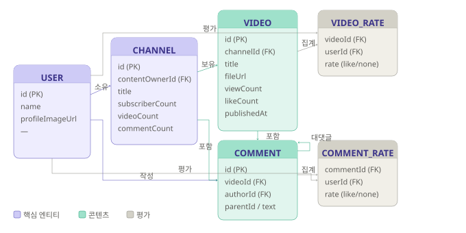
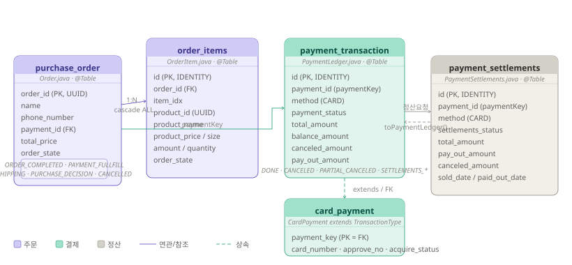
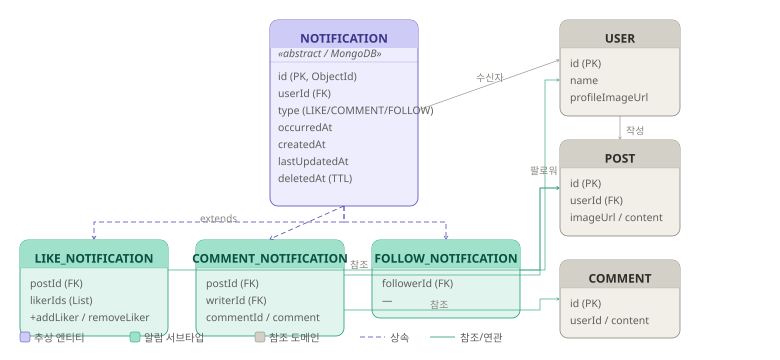

# 🛒 Live E-Commerce Platform

> 헥사고날 아키텍처 기반의 멀티모듈 라이브 커머스 백엔드 시스템

<br>

## 📌 프로젝트 개요

라이브 방송을 통한 실시간 상품 판매 플랫폼의 백엔드 시스템입니다.
도메인 중심 설계(헥사고날 아키텍처)와 멀티모듈 구조를 적용하여 각 도메인의 독립성과 확장성을 확보했습니다.
Apache Kafka를 활용한 이벤트 기반 비동기 통신으로 모듈 간 결합도를 낮추고, Redis를 통한 캐싱 전략으로 고성능 처리를 구현했습니다.

- **개발 유형**: 개인 프로젝트
- **GitHub**: [https://github.com/yejin0901/personalProject](https://github.com/yejin0901/personalProject)

<br>

## 🏗️ 시스템 아키텍처

```
live-ecommerce/
├── live-module        # 라이브 방송 도메인
├── payment-module     # 결제 도메인
├── notification-module # 알림 도메인
```

### 헥사고날 아키텍처 (Ports & Adapters)

각 모듈은 헥사고날 아키텍처를 적용하여 도메인 비즈니스 로직을 외부 의존성으로부터 완전히 분리했습니다.

```
[Inbound Adapter]  →  [Application Port]  →  [Domain]  →  [Output Port]  →  [Outbound Adapter]
  (Controller)           (UseCase)          (Entity)       (Repository)       (DB / Kafka / Redis)
```

<br>

## ⚙️ 기술 스택

### Backend
| 기술 | 버전 | 용도 |
|------|------|------|
| Java | 17 | 메인 언어 |
| Spring Boot | 3.x | 애플리케이션 프레임워크 |
| Spring Batch | 5.x | 대용량 배치 처리 |

### Database & Cache
| 기술 | 용도 |
|------|------|
| MS SQL (RDBMS) | 주문, 회원, 결제 데이터 영구 저장 |
| MongoDB (NoSQL) | 라이브 방송 이벤트, 채팅 로그 저장 |
| Redis | 세션 캐시, 재고 수량 동시성 제어 |

### Message Broker
| 기술 | 용도 |
|------|------|
| Apache Kafka | 모듈 간 이벤트 기반 비동기 통신 |

<br>

## 🔑 핵심 기능

### 📺 Live Module — 라이브 방송

- 라이브 방송 생성 및 상태 관리 (대기 / 진행 중 / 종료)
- 방송 중 실시간 상품 노출 및 구매 이벤트 처리
- MongoDB를 활용한 방송 이벤트 로그 저장

### 💳 Payment Module — 결제

- 주문 생성 및 결제 트랜잭션 처리
- 결제 완료 이벤트를 Kafka로 발행하여 알림·재고 차감 처리와 비동기 연동
- MS SQL 기반 주문/결제 데이터 정합성 보장

### 🔔 Notification Module — 알림

- Kafka Consumer로 결제 완료, 방송 시작 등 이벤트 수신
- 알림 발송 처리 (이메일 / 앱 푸시 등)
- 알림 이력 관리

<br>

## 🎯 기술적 의사결정 및 도전 과제

### 1. 헥사고날 아키텍처 도입
**배경**: 기능이 늘어날수록 도메인 로직과 인프라 코드(DB, Kafka 등)가 뒤섞이는 문제를 방지하고자 했습니다.

**적용**: 각 모듈의 도메인 레이어가 외부 기술(DB, Kafka, Redis)에 전혀 의존하지 않도록 Port 인터페이스를 정의하고, 구현체는 Adapter 레이어에 위치시켰습니다.

**결과**: 외부 기술 교체 시 도메인 코드를 수정할 필요가 없으며, 도메인 단위 테스트가 용이해졌습니다.

---

### 2. 멀티모듈 구조 설계
**배경**: 라이브, 결제, 알림 기능이 하나의 모듈에 혼재할 경우 의존성 오염 및 빌드 복잡도가 증가하는 문제가 있습니다.

**적용**: 각 도메인을 독립적인 모듈로 분리하고, 모듈 간 통신은 Kafka 이벤트를 통해서만 이루어지도록 설계했습니다.

**결과**: 각 모듈을 독립적으로 빌드·배포할 수 있으며, 특정 모듈의 변경이 다른 모듈에 영향을 주지 않는 장점이 있습니다.

---

### 3. Kafka 기반 이벤트 드리븐 설계
**배경**: 결제 완료 후 알림 발송, 재고 차감 등 여러 후속 처리를 동기로 처리하면 결제 응답 지연 및 강결합 문제가 발생할 가능성이 있습니다.

**적용**: 결제 완료 시 Kafka 토픽으로 이벤트를 발행하고, Notification Module과 재고 모듈이 각각 독립적으로 컨슘하여 처리하도록 설계했습니다.

**결과**: 결제 응답 속도 향상 및 후속 처리 모듈의 독립적 확장이 가능합니다.

---

### 4. Redis를 활용한 재고 동시성 제어
**배경**: 라이브 방송 중 동시 다발적 구매 요청 시 재고 초과 판매(Race Condition) 문제가 발생할 수 있습니다.

**적용**: Redis의 원자적 연산(DECR)을 활용하여 재고 수량을 관리하고, 결제 완료 후 DB와 동기화하는 전략을 적용했습니다.

**결과**: 동시 요청 환경에서도 재고 정합성을 보장합니다.

<br>

## 🚀 실행 방법

### 사전 요구사항
- Java 17+
- Docker (MS SQL, MongoDB, Redis, Kafka 컨테이너 실행용)

### 환경 설정

```bash
# 저장소 클론
git clone https://github.com/yejin0901/personalProject.git
cd personalProject/live-ecommerce

# 인프라 컨테이너 실행 (docker-compose 사용 시)
docker-compose up -d

# 빌드 및 실행
./gradlew build
./gradlew :live-module:bootRun
./gradlew :payment-module:bootRun
./gradlew :notification-module:bootRun
```

### 환경 변수 설정

```yaml
# application.yml 예시
spring:
  datasource:
    url: jdbc:sqlserver://localhost:1433;databaseName=ecommerce
  data:
    mongodb:
      uri: mongodb://localhost:27017/ecommerce
    redis:
      host: localhost
      port: 6379
  kafka:
    bootstrap-servers: localhost:9092
```

<br>

## 📂 패키지 구조 (헥사고날 아키텍처)

```
payment-module/
├── adapter/
│   ├── in/
│   │   └── web/              # REST Controller (Inbound Adapter)
│   └── out/
│       ├── persistence/      # JPA Repository (Outbound Adapter)
│       └── messaging/        # Kafka Producer (Outbound Adapter)
├── application/
│   ├── port/
│   │   ├── in/               # UseCase 인터페이스 (Inbound Port)
│   │   └── out/              # Repository 인터페이스 (Outbound Port)
│   └── service/              # 비즈니스 로직 구현체
└── domain/                   # 순수 도메인 엔티티 (외부 의존성 없음)
```

<br>

## 📄 License

This project is licensed under the MIT License.
